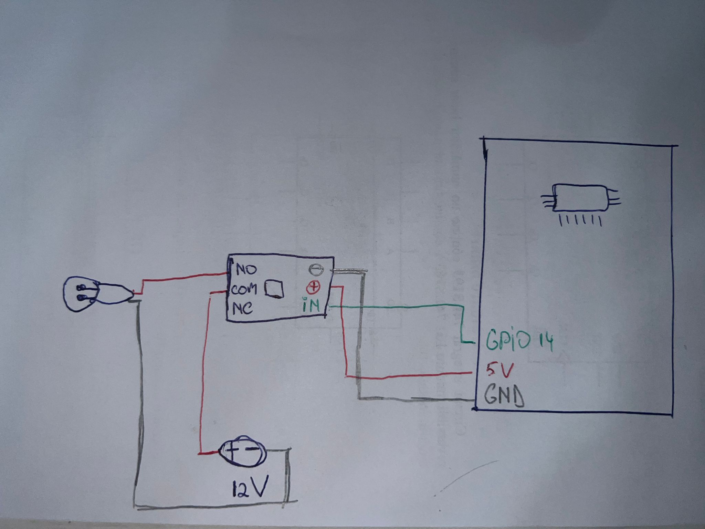
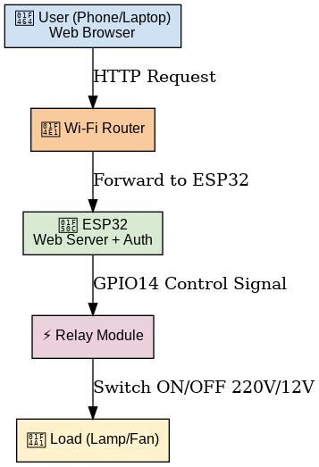
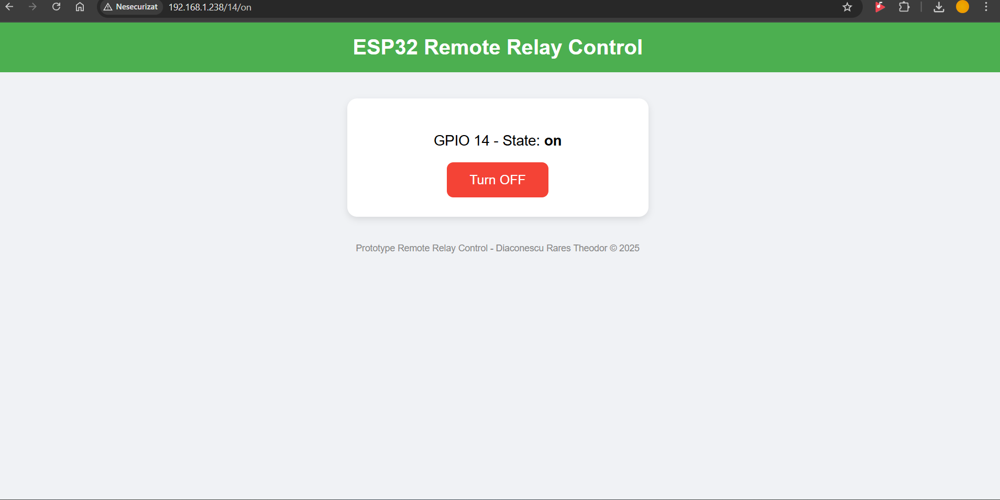

# ESP32 Remote Relay Control

## 1. Overview
This project demonstrates how to control a relay using an ESP32 through a web interface.  
The relay can be switched ON/OFF from any device connected to the same Wi-Fi network.  
The web server includes basic authentication (username & password).

---

## 2. Hardware Components
- ESP32 DevKitC V4  
- 1-channel relay module  
- Breadboard & jumper wires  
- 12V DC power supply  
- Light bulb / DC fan (as load)

---

## 3. Circuit Diagram
Below is the wiring diagram of the project:  

---

## 4. System Architecture
  

The ESP32 hosts a web server → client connects with browser → sends ON/OFF request → ESP32 toggles relay → load is switched.

---

## 5. Web Interface
The ESP32 serves a responsive webpage with two buttons:  

---

## 6. Demo Video
Watch the project in action:  

)

---

## 7. Code Structure
- `src/main.cpp` → main application logic  
- `include/functions.h` → helper functions (Wi-Fi connection, relay handling, webpage)  
- `platformio.ini` → PlatformIO configuration  

---

## 8. Future Improvements
- Add physical push button support (synchronized with web state)  
- Control multiple relays  
- Host webpage with external CSS/JS files for cleaner code  
- Implement secure HTTPS communication  

---

## 9. Author
Prototype developed by **Diaconescu Rares Theodor** (2025).  
